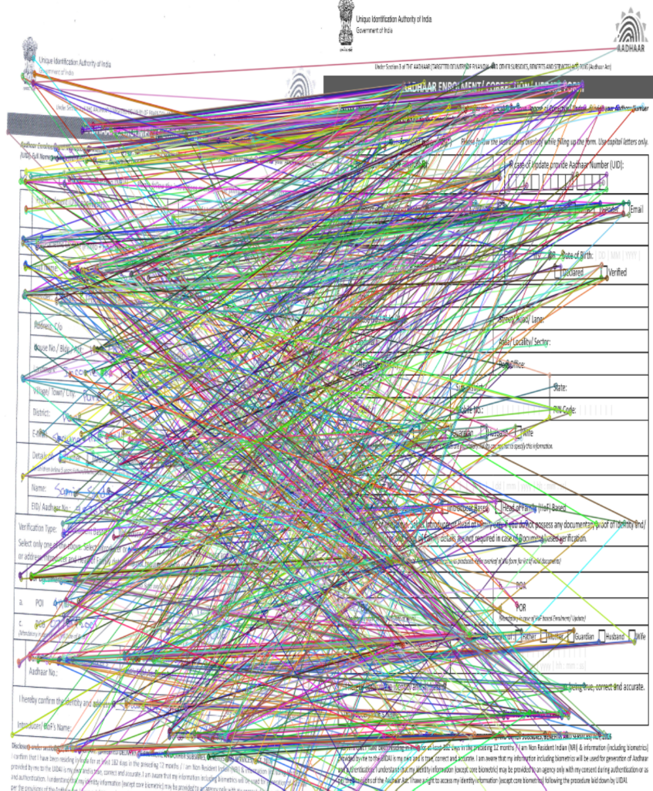
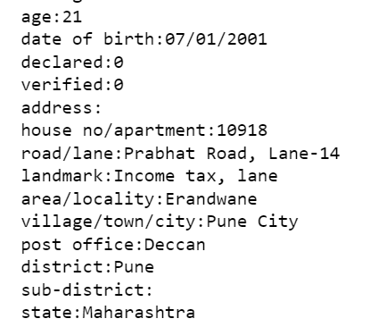

# Adhar-Enrollment-OCR-using-Google-Vision-API

**Email:** anikettathe.08@gmail.com

1. Many applicants submit handwritten applications.

2. It takes a long time to manually write down/convert all these entries. A system that can automatically perform OCR can covert the handwritten note to digital text is required. 

3. Developed an algorithm to digitize this process

# This is Adhar Enrollment form of Government of India (Original vs Filled):

    
    

After browsing I found few OCR's which I tried while working on the project:

1. PyTesseract(https://pypi.org/project/pytesseract/)

2. Keras-OCR (https://keras-ocr.readthedocs.io/en/latest/)  

3. Easy-OCR (https://www.jaided.ai/easyocr/documentation/)

4. TrOCR(https://huggingface.co/docs/transformers/model_doc/trocr) 

5. Paddle-OCR(https://github.com/PaddlePaddle/PaddleOCR)

6. Google Cloud Vision API(https://cloud.google.com/vision/)

# Pre-processing:

Every OCR listed above outputs all the texts it detects on the given input. We want only selected sections of the aadhar enrolment/update form to be detected by the OCR (Eg:Name,Gender,etc) which will be our output and not the whole aadhar enrolment form.

Feeding the whole form to any OCR will result in detection of texts on the whole page. Hence I have decided to do this with help of bounding box and only feed our region of interest which we want to output.

For this I had downloaded a blank copy of the form from the internet. Using cv2.ORB_create() , orb.detectAndCompute() , cv2.drawKeypoints() functions we can define how much number of features we want and match them to another image.

After trail and error method by using values ranging from 1000 to 8000 I tried many combinations I selected 6000-6500 as good fit. Setting the value very low or very high was distorting the image and not aligning the image as per our blank form.  

This process was necessary, if the input image is not aligned properly the bounding boxes which we are going to define would not be helpful. Hence I first tried matching input image with the blank form I downloaded from internet.

  

    
    

  

Here we can see the keypoints and matching images. Input gets matched to our base/empty form.  

After this with the code (`Mousepoints.ipynb`) region of interest / bounding boxes were made. Then array of these bounding boxes were saved in main code with name `roi`

Below an input image given in document pdf that has first being matched and then these bounding boxes have been drawn on them can be seen below.

    

# OCR:

Now according to these each of these snapshots/bounding boxes are sent to OCR to perform text detection. First I tried Pytesseract and I found that since it was good for detecting printed text but it was giving bad accuracy while detecting handwritten text like below.

    

After reading few documentations I found that the accuracy of Pytesseract depends on many factors like the resolution of image, printed/handwritten text, blurriness, it is good for detecting text on high resolution printed documents.  

Then I tried keras ocr. Keras ocr is great if we want to detect printed text on an random image which isn't a document but this ocr also failed to give good results.

After this I tried easyocr. Easyocr sometimes performed much better in comparison to keras and tesseract ocr but still it wasn't upto the mark.

EasyOCR performed better than keras and tesseract ocr on handwritten text. Then I tried TrOCR and it gave the best results compared to all above but the problem with TrOCR was after 5-6 it starts giving garbage values sometimes.

I thought of using 3 TrOCR like while scanning every TrOCR will make 5 predictions and then next 5 ones be passed to the next one to do predictions and similarly for third. I tried this but still the issue was not solved but just reduced a bit.

Then I tried PaddleOCR. It gave better results compared keras and tesseract above and sometimes even better than TrOCR but on average TrOCR was performing better.

Then lastly I tried Google Vision API and it gave the best results compared to all above and was accurate like 95-96% time like below. The result on one of the form can be seen below.

    
    

Hence lastly I ranked OCRs from best to worst as below(acc to me):

Google > TrOCR > PaddleOCR > EasyOCR > Pytesseract > KerasOCR

And selected Google Vision API

But the main drawback of this was if API is we are given 1000 free API req and after that we are charged 1.5\$ for 1000-5million req per month. And we have 14-15 text bounding boxes , every time we run the code the API gets called approx. 10-15 times.

To avoid this I tried finding all the text boxes using cv2.morphology() which is used for edge detection (explained after 2-3 pages) which I used for checkbox detection and tried merging them in one image and then sending them to the API so that it only gets called one and we can use it for 1000 forms without charges.

The merged image which gets sent at once an example is given below

We can merge and send it all at once like above but the main problem is if any one of sequence is compromised (like one didn't got detected or missed) then whole sequence will be affected.

The code for above is can be found in `GCV_free.ipynb`  

The one where the code used API for every bounding box and sends 10-15 API request is `GCV_notfree.ipynb`  

Advantage of `GCV_notfree.ipynb`:

1. Accurcay is very high

2. Chance of Sequence getting compromised is very less compared to `GCV_free.ipynb`

Disadvantage of `GCV_notfree.ipynb':  

If API req per month exceeds 1000 we have to pay 1.5\$ for 1000-5million request

# Checkbox: 

The form also had checkboxes. Checkboxes are not detected by these OCRs. For this I used only Opencv and functions like cv2.morphology() to detect vertical and horizontal edges.

Detailed code for it : (https://docs.opencv.org/3.4/dd/dd7/tutorial_morph_lines_detection.html)

Logic: Detect horizontal and vertical edges with opencv then using cv2.subtract() subtract the horizontal and vertical edges. If the checkbox had check inside only it will be retained and if no check in box it would contain mostly nothing(if edges are removed perfectly) like below:

After trail and error I decided to keep line_min_width = 11  

If line_min_width= small value(< 5)  

It detected horizontal and vertical edges much better but it had started to also erase the inside checkbox and due to that its pixelvalue was getting affected

If line_min_width= big value(>15 or 18)  

The final image even after subtracting would contain horizontal and vertical edges which affected the pixelvalue and result in false positive

Hence line_min_width=11 was giving results in between these two and seemed a good trade-off Hence selected 11.

Hence I tried to detect horizontal edges and vertical edges and subtracted it from original so only checkmark is retained.  And then I tried counting pixels inside it.  

If a box had check its value would be high and if not then there might not be check in it.  I also observed if the checkmark was of blue color compared to black it was getting easily detected compared to black and giving much better results.

After trial and error I decided the range above. I also applied upper limit as 200 because if some situation like below occurred it would have no problem as its pixel value would cross 220 above approx.

    

Where would this fail?

If the edges are not properly removed it will contribute to final pixelvalue and might lead to incorrect answer.
    Here is the remaining part of the Markdown conversion:

2.   

Here the checkmark is almost at border and since we used bounding boxes the part outside box will be eliminated and since the checkmark is nearly at edge it will be removed during cv2 morphological operation and will lead to false value.

Same logic has been used in `GCV_free.ipynb` for `texts` also to similarly remove empty text boxes and give them value =0 and the ones with values are merged along axis=0 using Cv2.concatenate() and sent at once to API to get detection.  

If empty boxes are directly concatenated along with the text one it can happen 3 text boxes were concatenated one of which was empty and after detection there will be only 2 output as one was empty box with text and then to match the correct input to correct output becomes difficult and sequence also gets compromised. Hence I tried to avoid this by only merging texts having values and sending that to API so if input text empty box would be =0 and the one with texts would be correctly matched and sequence wouldn't be compromised.

Signatures detected are directly saved in folders.  

In the end, Three algorithms have been proposed 

1. **TrOCR**- Free, but not as accurate as Google Vision API, also gives many garbage values as the time goes.

2. **GCV_free**: Can be used for 1000 forms per month for free. Drawback is if the cv2 operations fail to detect empty boxes it would be concatenated to text ones and during final outcome it will happens Eg: 5 input text boxes sent but only only 4 output were seen and to map which one from these 5input had empty box would not be ideal.  

3. **GCV_notfree**: Very accurate. Also sequence doesn't get compromised even if the text box is empty. Only downsite is for evaluation of one form 10-15 times API is called and if 1000 req are exceeded per month then we have to pay 1.5\$  

According to me GCV_notfree would be the ideal amongst all three because it is very accurate, sequence isn't compromised and even if 1000 req are exceeded by paying just 1.5\$ per month we get Units 1001 - 5,000,000 / month,

`Allcodes.ipynb` contains all the testing and various OCR's that were tried during that time

